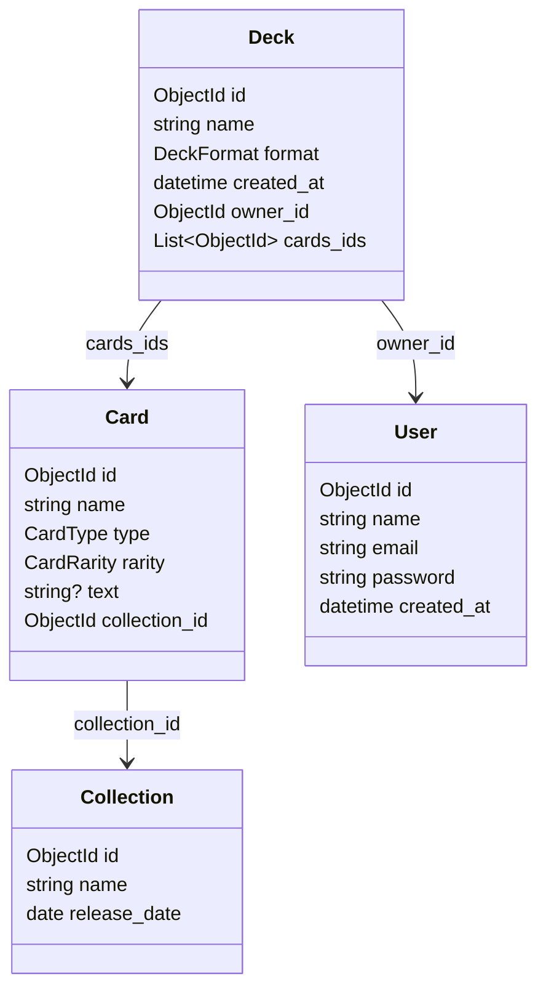

```mermaid
classDiagram
    class Card {
        ObjectId id
        string name
        CardType type
        CardRarity rarity
        string? text
        ObjectId collection_id
    }

    class Collection {
        ObjectId id
        string name
        date release_date
    }

    class Deck {
        ObjectId id
        string name
        DeckFormat format
        datetime created_at
        ObjectId owner_id
        List~ObjectId~ cards_ids
    }

    class User {
        ObjectId id
        string name
        string email
        string password
        datetime created_at
    }

    Card --> Collection : collection_id
    Deck --> User : owner_id
    Deck --> Card : cards_ids
```
